# 小驴常用（内测版）

> **内测说明**：当前版本仅实现基础功能，仍有较多功能处于开发与测试阶段。欢迎对本插件感兴趣的用户参与内测体验，并通过交流 QQ 群 **871707735** 反馈 Bug、提交功能需求。对功能完整性和运行稳定性有较高要求的用户，建议等待正式版发布后再行使用。项目将持续更新迭代，感谢您的理解与支持。

[](https://github.com/ai68298100/xiaolv-common/actions/workflows/ci.yml)
[](https://github.com/ai68298100/xiaolv-common/releases)
[](LICENSE)

基于思源文档和块的**常用内容快速调用器**：常用语、客服回复、邮件模板、多行 Markdown、代码、网址、图片、附件、思源块结构与块引用——一条目锚定一个真实思源块，来源可回链、失效可见。

> 独立运行，不依赖小驴雷切；同时提供 `xiaolv-common/v1` 协议供小驴系列插件联动。

**核心能力一览**：插入时变量填充（文本/下拉/日期）· 片段嵌套 · AI 整理/草稿/变换/语义找 · 模板包分享 · 使用计数与「常用」排序 · 拼音直达 · 分类分组 · 移动端底部 sheet · 提供方协议联动。

## 小驴系列插件

| 插件 | 简介 | GitHub |
|---|---|---|
| [小驴雷切](https://github.com/ai68298100/siyuan-speed-switch) | 统一切换与工作上下文平台。 | [仓库](https://github.com/ai68298100/siyuan-speed-switch) |
| [小驴打卡](https://github.com/ai68298100/siyuan-checkin) | 本地优先的习惯、打卡与复盘工作台。 | [仓库](https://github.com/ai68298100/siyuan-checkin) |
| [小驴人脉](https://github.com/ai68298100/siyuan-contacts) | 在思源中管理联系人、人际关系及相关资料。 | [仓库](https://github.com/ai68298100/siyuan-contacts) |
| [小驴拾遗](https://github.com/ai68298100/siyuan-glean) | 整理剪藏文章，支持阅读管理与日后回顾。 | [仓库](https://github.com/ai68298100/siyuan-glean) |
| [小驴考试（内测版）](https://github.com/ai68298100/siyuan-exam) | 本地题库、刷题、模考、错题复盘与 AI 辅助。 | [仓库](https://github.com/ai68298100/siyuan-exam) |
| [小驴管家（内测版）](https://github.com/ai68298100/siyuan-home) | 家庭与生活台账、到期提醒及事务跟进。 | [仓库](https://github.com/ai68298100/siyuan-home) |
| [小驴闪卡（内测版）](https://github.com/ai68298100/siyuan-lv-cards) | 思源笔记中的本地优先全生命周期闪卡学习平台。 | [仓库](https://github.com/ai68298100/siyuan-lv-cards) |
| [小驴常用（内测版）](https://github.com/ai68298100/xiaolv-common) | 基于思源块快速调用常用语、模板、代码等内容。 | [仓库](https://github.com/ai68298100/xiaolv-common) |

## 界面速览（全部为生产 DOM+CSS 渲染截图，见 docs/design/）

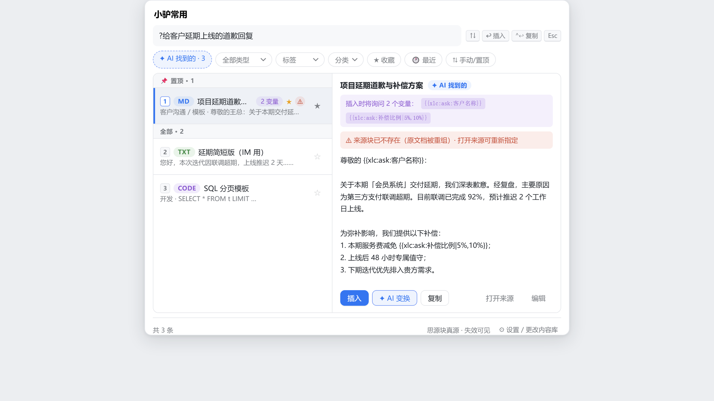

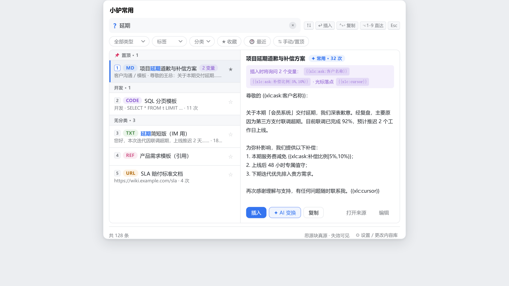

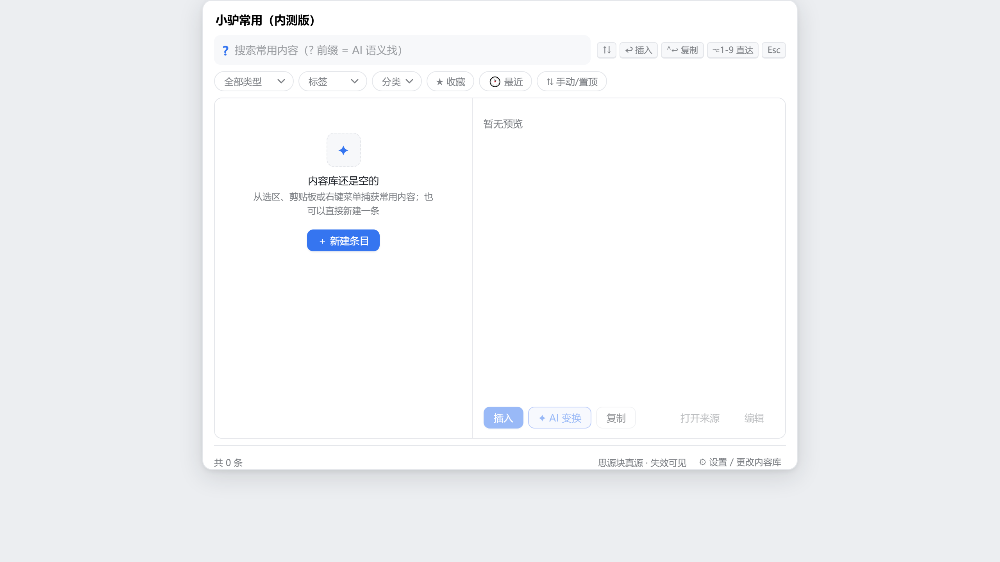

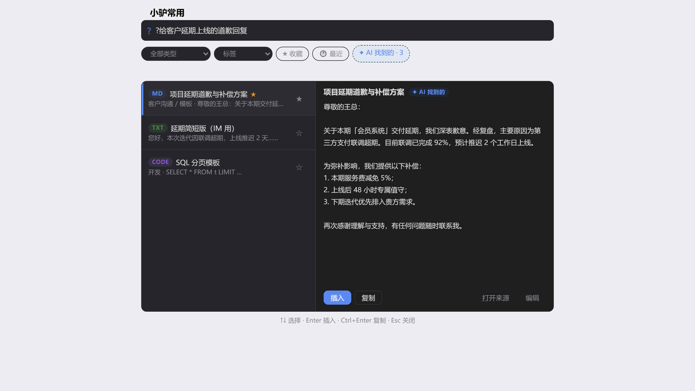

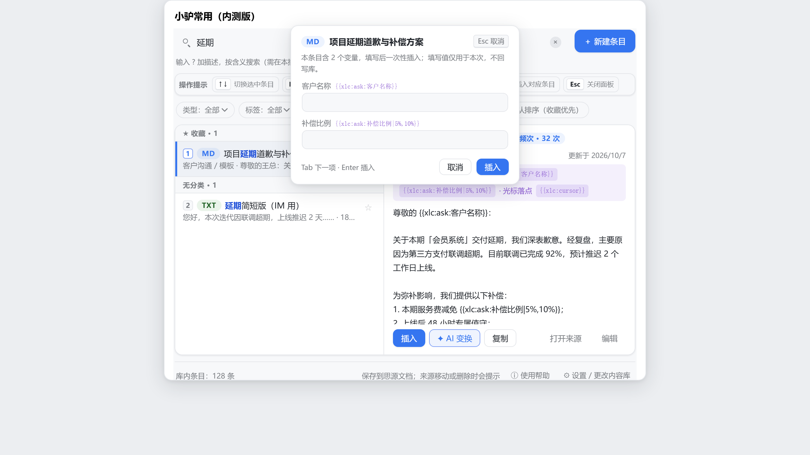

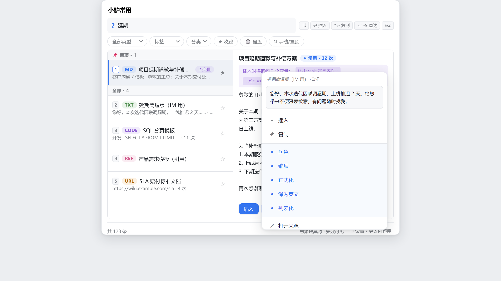

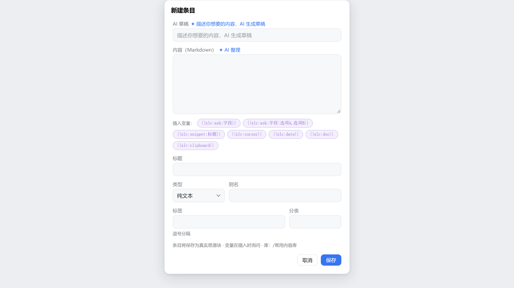

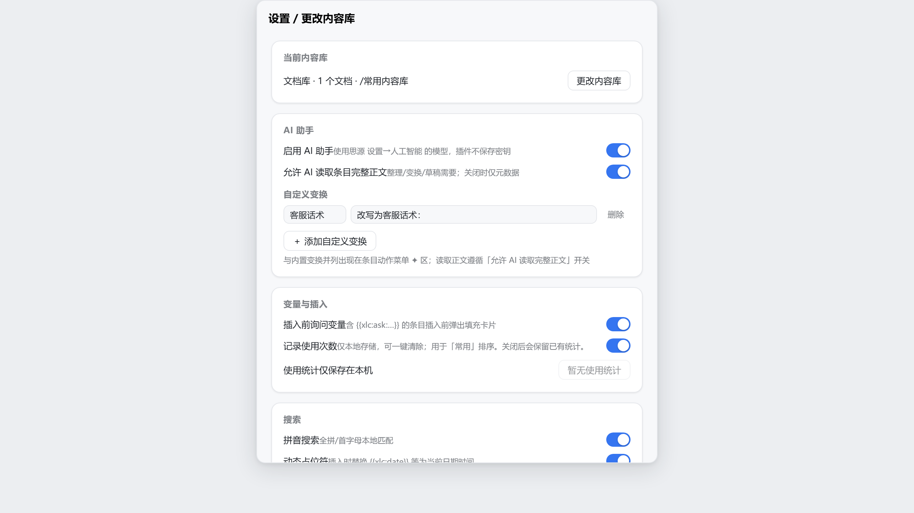


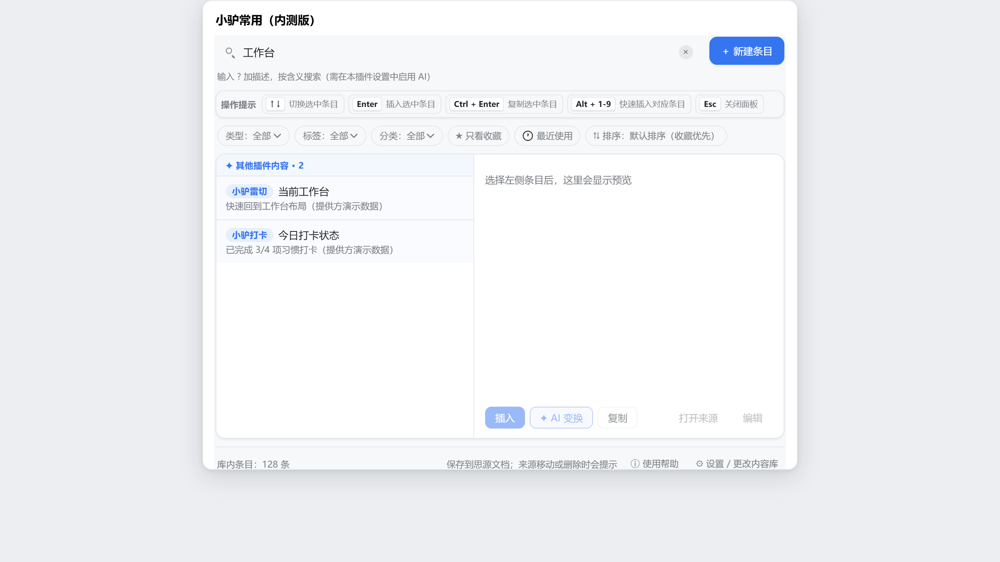

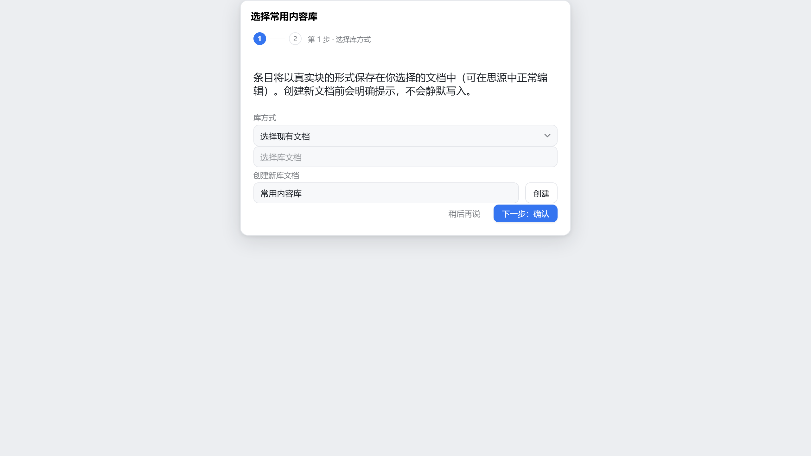

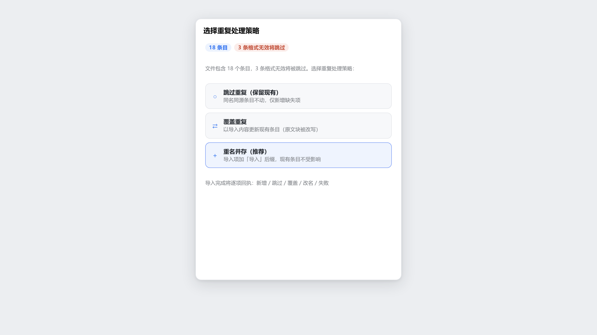

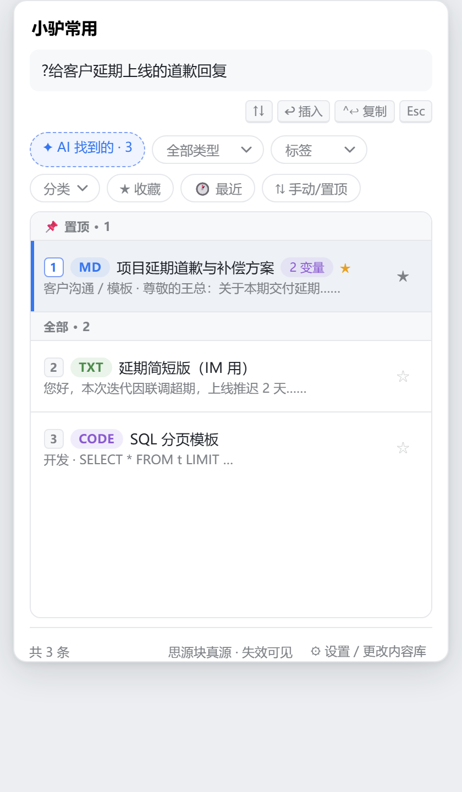

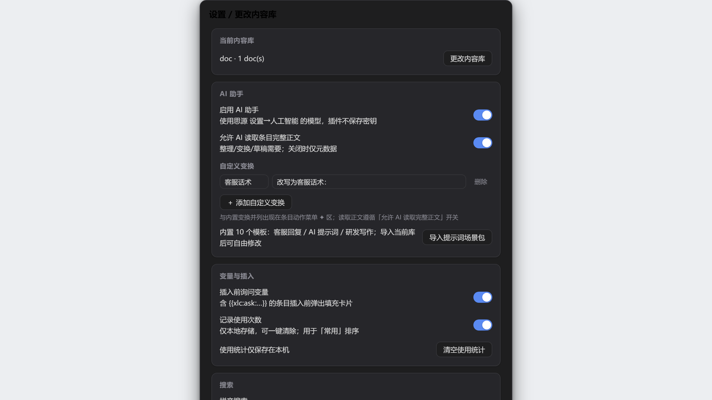

## 定位边界

**是**：思源内的常用内容保存与快速复用（搜索 → 预览 → 插入 / 复制 / 打开来源）。

**不是**：密码管理器、剪贴板历史、云同步服务、任意应用自动发送器、JS/SQL 执行器、雷切第二切换器、片段实验室管理器。

## 核心设计

1. **思源块 = 内容唯一真源**。每个条目是库文档中的一个真实块（普通块或 superblock 包装），插件不复制正文进私有库；删除插件，用户数据零损失。
2. **元数据走用户可见的块属性**（`custom-xlc-id/-type/-title/-alias/-tags/-category/-src-doc/-src-block/-url/-target/-created/-updated`），可在思源属性面板查看和手工修补。
3. **插件侧车（`data/storage/petal/xiaolv-common/`）只存**：库配置、收藏、最近使用、排序偏好、provider 注册——全部版本化、可重建、可迁移。
4. **不用 SQL**：遍历用 `getChildBlocks`（文档序），失效检测用 `checkBlocksExist`，内容用 `getBlockKramdown`（见 ADR 0003 的嵌入块边界说明）。
5. **诚实能力声明**：移动端直接插入、图片位图复制未真机验证前，自动降级为复制并明示「待验证」。

## 捕获入口（八种，覆盖全部右键上下文）

| 入口 | 捕获内容 |
| --- | --- |
| 选中文字 + ⌥⇧S / 右键菜单 | 选区文本（类型自动推断） |
| 右键当前块 / ⌥⇧B | 整块内容（kramdown 保真） |
| 右键块引用 | 被引用块 → blockref 条目 |
| 右键链接 | http(s) → URL 条目；assets/ → 附件条目 |
| 右键图片 | assets/ 图片 → 图片条目 |
| 右键文档树选中文档 | 一键设为常用库（confirm） |
| 剪贴板 / 命令 / 面包屑 / 顶栏 / 编辑器工具栏 | 各场景直达 |

## 数据模型

```
CommonItem（思源块承载）
├── id: "xlc-xxxx"            ← 稳定逻辑 ID（custom-xlc-id，跨工作区/导入导出不变）
├── blockId / libraryDocId    ← 物理定位（库文档中的锚定块）
├── itemType                  ← text|markdown|url|code|image|asset|blockref|structure
├── title / alias / tags / category
├── summary                   ← 有界摘要（≤240 字，内存索引缓存，可重建）
└── source                    ← sourceDocId / sourceBlockId / sourceType（回链）

侧车 state.json（v2）: favorites / recents / sort / uiPrefs / providers
库配置 config.json:    mode(doc|tree|notebook) + containerDocIds / notebookIds
```

## 插入语义（按类型分派）

| 类型 | 插入 | 复制 | 打开来源 |
| --- | --- | --- | --- |
| text | 段落文本 | 纯文本 | 来源文档/块 |
| markdown | 原样 kramdown | Markdown | 来源文档/块 |
| url | `[标题](url)` 链接 | 裸 URL | 外部浏览器（仅 http/https） |
| code | 代码块（保留语言） | 裸代码 | 来源文档/块 |
| image | `` 图片块 | Markdown 链接（位图复制待验证） | 资源预览 |
| asset | `[名](assets/…)` 链接块 | Markdown 链接 | 资源预览 |
| blockref | `((id '锚文本'))` 引用 | 复制内容（copy-content） | 目标块 |
| structure | 原样结构（superblock 剥壳） | Markdown | 来源文档/块 |

资源缺失时：插入/打开诚实失败，复制链接仍可用；来源块/文档删除显示「来源失效」。

## AI 能力（默认关，ADR 0005）

> 思源智能体已注册只读能力 `xiaolv_common_search`（按关键词搜条目，仅返回标题/类型/标签元数据，`localRead` 声明，不含正文）——在思源「设置→人工智能」的智能体中可直接调用。

使用你在思源 **设置→人工智能** 配置的模型，插件不保存任何密钥：

| 功能 | 入口 | 出域内容 |
| --- | --- | --- |
| **AI 整理** | 捕获表单「✦ AI 整理」→ 自动填标题/标签/分类建议，逐项采纳 | 条目正文（需开启「允许读取完整正文」） |
| **AI 草稿** | 新建表单描述一句话 → 生成模板草稿 | 描述文本（同上） |
| **AI 变换** | 动作菜单 ✦ 润色/缩短/正式化/译英/列表化 → 预览后选「插变换版/插原文」，**原文永不被改写** | 条目正文（同上） |
| **AI 语义找条目** | 搜索框 `?` 前缀（如 `?给客户的道歉回复`）→ 标注「AI 找到的」 | **仅元数据**（标题/别名/标签/分类/摘要），不含正文与来源 ID |
| **AI 标签体检** | 设置面板「✦ AI 标签体检」→ 归并/改名建议清单（只建议，不自动修改） | 仅标签清单 |

另有**动态占位符**（code 条目保持字面，绝不改写代码）：条目中写 `{{xlc:date}} / {{xlc:time}} / {{xlc:datetime}} / {{xlc:weekday}} / {{xlc:title}} / {{xlc:doc}} / {{xlc:path}} / {{xlc:clipboard}}`，插入或复制时替换为当前日期时间/当前文档标题与路径/剪贴板文本（无活动文档等场景替换为空串）（`xlc:` 命名空间不误伤思源模板；存储内容始终保留模板原文，可在设置关闭）。

## 变量、片段嵌套与模板包

| 能力 | 用法 |
| --- | --- |
| **插入时变量填充** | 内容写 `{{xlc:ask:字段}}`（文本）/ `{{xlc:ask:字段\|选项A,选项B}}`（下拉）/ `{{xlc:ask:字段\|date}}`（日期）→ 插入前弹填充卡片（Enter 插入 / Esc 取消 / Tab 切字段）；填写值仅用于本次不回写库；未填充兜底 `__字段__` 可见可改 |
| **光标落点** | `{{xlc:cursor}}` 标记位置（宿主 API 限制：插入后光标落于内容之后） |
| **片段嵌套** | `{{xlc:snippet:标题}}` 插入时展开为另一条目内容（深度 ≤3、环检测；不可解析落 `__片段：标题__`）；预览/填充卡所见 = 插入所得 |
| **常用排序** | 插入/复制自动记次数（仅本机、可清空）；排序档「⇅ 常用」= 次数 × 最近使用 |
| **模板包分享** | 设置 → 数据 → 「模板包」：按分类筛选、命名导出 `.md` 包（含变量清单）；导入方得到真实思源块——分享的是活的块，不是文本快照 |
| **自定义 AI 变换** | 设置 → AI 助手 → 自定义变换（≤10 条）：你的指令与内置五种并列出现在动作菜单 ✦ 区 |
| **提示词场景包** | 设置 → AI 助手 → 「导入提示词场景包」：内置 10 个模板（客服回复 / AI 提示词 / 研发写作），演示全部变量能力 |
| **快速捕获** | 命令「快速捕获剪贴板为条目」（默认 ⌥⇧V）：无表单一步入库、类型推断、同文自动跳过并提示 |

## 桌面搜索弹窗（调用中枢）

双栏（左列表右预览）/ 窄窗单列 / 移动端底部 sheet；键盘全链路 `↑↓ 选择 · Enter 插入 · Ctrl+Enter 复制 · Alt+1~9 直达 · Esc 关闭`；类型/标签/分类筛选、★收藏置顶、🕐最近、⇅排序、`?` 前缀 AI 语义找、提供方分区（其他小驴插件内容源）；条目显示类型徽标 / 变量徽标 / 使用次数 / 来源失效 ⚠。

## B-001 真机验收（一键脚本）

```bash
pnpm e2e:iso      # 推荐：独立后台验收——用本机思源内核起隔离实例（独立工作区+独立端口），
                  # 自动读取令牌，不影响正在运行的主思源，跑完自动关闭（零依赖，Node 18+）
SIYUAN_ORIGIN=http://127.0.0.1:6806 SIYUAN_TOKEN=<你的令牌> pnpm e2e   # 对指定实例验收
```

脚本镜像插件全部内核流（建库文档 → 追加条目+属性 → 属性回读/kramdown 往返/搜索/导出 → 更新 → 清理核验），逐项输出 ✔/✖ 与汇总。**内核链路已于 2026-10-08 在真实内核 v3.8.6 上验收通过（12/12）**；思源前端（Electron）内的插件运行时验收（安装启用、界面交互、AI 真实模型调用）仍待现场确认。

未配置模型/超时/空响应均诚实提示；总开关与正文出域开关在引导面板「AI 助手」区，任何输入下默认关闭（门禁测试锁定）。

## xiaolv-common/v1 协议

```js
// 其他插件（如雷切、打卡）通过 app.plugins 找到本插件实例：
const common = app.plugins.find(p => p.name === "xiaolv-common");
await common.service.search({text: "客服", itemType: "", tag: "", scope: "all"});
await common.service.insert(itemId, {mode: "insert"});   // insert|copy|copy-content|insert-ref|insert-embed|open
await common.service.copy(itemId);
await common.service.openSource(itemId);
common.registerProvider({protocol: "xiaolv-common", protocolVersion: 1, pluginId: "xiaolv-checkin", displayName: "小驴打卡"});
common.protocolCommands["xiaolv.common.open"]();          // 稳定命令 ID
```

- 服务接口：`getCapabilities / search / get / save / update / remove / insert / copy / openSource / reindex / getRecent / getFavorites`
- 命令 ID：`xiaolv.common.open / saveSelection / insert / copy / openSource`；插件命令另有 捕获当前块(⌥⇧B)/捕获当前文档；接入示例见 [docs/provider-guide.md](docs/provider-guide.md)
- 事件（window CustomEvent，detail 带 protocolVersion）：`xiaolv:common:item-created / item-updated / item-deleted / item-inserted`
- 兼容行为：未知字段保留透传；未知能力忽略；更高主版本明确拒绝（不静默降级）。

## 安装 / 升级 / 备份

- **安装**：集市（待上架）或手动——把 `package.zip` 解压到 `<工作空间>/data/plugins/xiaolv-common/`，重启思源并在「设置 → 集市 → 下载」中启用。启用后可在命令面板搜索「打开小驴常用（内测版）」或点击顶栏图标进入；若侧车设置读取失败，插件仍会保留这些入口并提示原因。
- **首次使用**：点击顶栏图标 → 选择库（创建新文档会先确认；或指定现有文档/笔记本）。
- **升级**：覆盖插件目录后重启；侧车 schema 自动迁移（v1→v2）；未来版本数据只读保留不降级改写。
- **备份**：库内容 = 普通思源文档，随思源同步走；导出 JSON（含全部条目与来源引用）或 **Markdown 包 ZIP**（items.md + assets/ 资源，无依赖解压即读）；恢复 = 导入 JSON 或 **Markdown 包**（自动识别文件类型，同一套校验/冲突策略/回执）；Markdown 包可被任何文本工具阅读。
- **卸载**：不删除库文档与块属性；侧车目录由思源清理。

## 开发

```bash
pnpm i
pnpm run check   # tsc --noEmit
pnpm test        # esbuild 转译 + node --test（209 项）
pnpm run build   # dist/ + package.zip
node scripts/render-prototype.cjs    # 原型图截图（需 Playwright Chromium）
pnpm run test:ui                # 生产 UI 冒烟门禁（15 组断言 + 截图，需 Playwright Chromium）
```

系列协议见 [AGENTS.md](AGENTS.md)；路线见 [ROADMAP.md](ROADMAP.md)；阻塞见 [BLOCKERS.md](BLOCKERS.md)；取舍见 [docs/adr/](docs/adr/)；宿主 API 能力矩阵见 [docs/host-contract.md](docs/host-contract.md)。

## 已知限制（诚实清单）

- **内核链路已真机验收**（2026-10-08，独立内核 v3.8.6，12/12 通过）；仍待验收：思源前端（Electron）内的插件运行时（安装启用、界面交互、AI 真实模型）与 Android 真机（BLOCKERS B-001 前端部分 / B-002 / B-003）：移动端插入自动降级为复制；图片位图复制降级为 Markdown 链接。
- 拼音搜索：已接入 tiny-pinyin（本地注解，设置可关，ADR 0004/R5）；多音字按常用读音。
- 库文档树模式从根文档最多展开 3 层子文档；条目索引上限 2000（超出截断并明示，数据仍安全在库中）。
- 导入冲突按逻辑 ID 判定（无内容级 diff）。
- 「选择现有文档」支持通过宿主公开文档搜索 API 按关键词选择；真实宿主写入验收仍受 B-001 阻塞。
